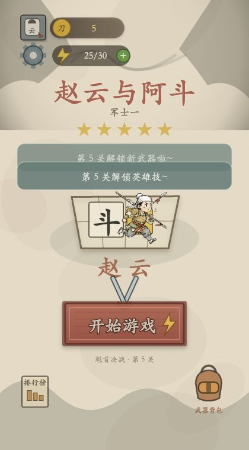

# 赵云与阿斗

一款在浏览器中运行的水墨汉字塔防小游戏。玩家通过征兵、摆放和合成字牌组建部队，拼出赵云、关羽、张飞、黄忠、刘备，并守护阿斗通过前五关。



## 运行环境

- Python 3.9 或更高版本
- Chrome、Edge、Firefox 或 Safari 的较新版本
- 仅运行游戏不需要安装 Node.js 或 npm 依赖
- 运行自动测试建议使用 Node.js 18 或更高版本

项目使用原生 HTML、Canvas 和 ES Module，没有后端服务、数据库或第三方 npm 运行依赖，也不需要构建。

## 获取并启动

```bash
git clone https://github.com/guoxq971/zhaoyunadou.git
cd zhaoyunadou
python3 scripts/dev-server.py 8460
```

浏览器打开：<http://127.0.0.1:8460/>

也可以通过 npm 启动；项目没有第三方依赖，因此不需要先执行 `npm install`：

```bash
npm run dev
```

端口 `8460` 已被占用时，换一个端口：

```bash
npm run dev -- 8461
```

然后访问 <http://127.0.0.1:8461/>。

Windows 如果没有 `python3` 命令，可以使用：

```powershell
py -3 scripts/dev-server.py 8460
```

不要直接双击 `index.html`。游戏通过 ES Module 加载源码和图片素材，应通过上面的 HTTP 服务访问。

## 游戏操作

| 操作 | 键盘 | 鼠标或触控 |
|---|---|---|
| 开始游戏、迎敌、放置选中牌 | `Enter` 或空格 | 点击对应按钮或棋盘 |
| 拿起营栏牌 | `1`–`5` | 从营栏拖拽 |
| 征兵 | `R` | 点击“征兵” |
| 使用毛笔 | `B` | 点击毛笔后选择棋盘单位 |
| 使用铲子开地 | `X` | 将普通铲拖到封地 |
| 暂停或继续 | `P` | 点击左上角暂停按钮 |

同种、同字且同等级的牌可以合成为更高等级。两个正确顺序的英雄字相邻放置后会自动解锁英雄；英雄技能在战斗中自动释放。洛阳铲会定时产生普通铲子。

## 运行测试

完整测试覆盖征兵、合成、英雄技能、双路线战斗、前五关通关和 Chrome 截图证据：

```bash
npm test
```

仅复验截图清单：

```bash
npm run test:artifacts
```

截图证据位于 `test-artifacts/screenshots/`。最新一次实机测试包含前五关、五名英雄、洛阳铲、升级、暂停和 Boss 战。

## 存档与声音

- 星级进度保存在当前站点的浏览器 `localStorage` 中。
- 若要重置进度，请清除 `127.0.0.1` 对应端口的站点数据。
- 隐私模式或禁用本地存储时，进度只在当前页面会话中保留。
- 浏览器要求用户交互后才能播放 WebAudio；首次点击或按键后声音才会启用。声音被浏览器拒绝时不影响游玩。

## 目录说明

```text
assets/          游戏图片素材
src/             游戏逻辑、渲染和输入模块
scripts/         本地服务器与截图素材处理脚本
test/            自动测试
test-artifacts/  Chrome 实机截图与可追踪清单
index.html       游戏入口
```

## 常见问题

### 页面打不开

确认终端中的服务器仍在运行，并检查访问地址与启动端口一致。端口冲突时换用 `8461`、`8462` 等空闲端口。

### 修改代码后页面没有变化

使用 `scripts/dev-server.py` 启动时响应会带 `Cache-Control: no-store`。仍未更新时，在浏览器执行强制刷新。

### `npm test` 的截图校验失败

截图测试会校验图片格式、代码指纹和 manifest。修改 `index.html`、`package.json`、`assets/`、`src/` 或 `test/` 后，需要重新生成对应截图证据，不能直接沿用旧指纹。

## 许可说明

本仓库目前未声明开源许可证。未经仓库所有者明确许可，请勿自行再分发、商用或重新授权源码与素材。
