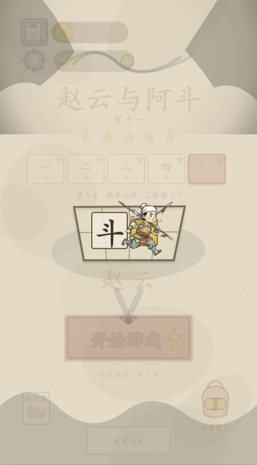

# 赵云与阿斗

一款在浏览器中运行的水墨汉字塔防小游戏。玩家通过征兵、摆放和合成字牌组建部队，拼出赵云、关羽、张飞、黄忠、刘备，并守护阿斗通过前五关。

> 开发、重构或维护本项目之前，请先完整阅读 [AGENTS.md](AGENTS.md)。它是项目介绍、16 条系统责任线、真实目录结构和多人协作规则的首要入口。



## 运行环境

- Node.js 18 或更高版本
- Chrome、Edge、Firefox 或 Safari 的较新版本
- 项目没有第三方 npm 运行依赖，不需要执行 `npm install`

项目使用原生 HTML、Canvas 和 ES Module，没有后端服务、数据库或第三方 npm 运行依赖，也不需要构建。

## 获取并启动

```bash
git clone https://github.com/guoxq971/zhaoyunadou.git
cd zhaoyunadou
npm start
```

浏览器打开：<http://127.0.0.1:8460/>

开发时也可以使用同一个 Node 启动器：

```bash
npm run dev
```

端口 `8460` 已被占用时，换一个端口：

```bash
npm run dev -- --port 8461
```

然后访问 <http://127.0.0.1:8461/>。

需要让局域网设备访问时显式监听所有网卡：

```bash
npm run dev -- --host 0.0.0.0 --port 8460
```

不要直接双击 `index.html`。游戏通过 ES Module 加载源码和图片素材，应通过上面的 HTTP 服务访问。

## 游戏操作

| 操作 | 键盘 | 鼠标或触控 |
|---|---|---|
| 标题页选择已解锁关卡 | `1`–`5` | 点击五枚关卡军令章 |
| 重置星级与最佳纪录 | 标题页连续按两次 `R` | 3 秒内连续点击两次“重置进度” |
| 开始游戏、迎敌、放置选中牌 | `Enter` 或空格 | 点击对应按钮或棋盘 |
| 拿起营栏牌 | `1`–`5` | 从营栏拖拽 |
| 批量征兵 | `R` | 点击“征满”，按逐次费用尽量填满营栏 |
| 使用毛笔 | `B` | 点击毛笔后选择棋盘单位 |
| 使用铲子开地 | `X` | 将普通铲拖到封地 |
| 暂停或继续 | `P` | 点击左上角暂停按钮 |
| 返回标题页 | `Esc` | 当前仅提供键盘入口 |

字牌可在营栏、营栏与棋盘、棋盘内部移动；拖到另一个可移动字牌上时会原子交换，拖到棋盘上的同种同字同等级牌时优先合成。升级后的牌仍可继续移动或交换。两个正确顺序的英雄字相邻放置后会自动解锁英雄；英雄技能在战斗中自动释放。洛阳铲会定时产生普通铲子。

## 运行测试

完整测试覆盖征兵、合成、英雄技能、双路线战斗、前五关通关、Host 契约、三次启停销毁、确定性随机和 Chrome 截图证据：

```bash
npm test
```

只校验 Game Pack 的 Schema、版本、跨文件引用、地图语义和素材文件：

```bash
npm run game-pack:validate
```

只运行系统所有权、deep import、平台泄漏和 Host 边界门禁：

```bash
npm run test:boundaries
```

修改 `games/zhaoyun-adou/sources/balance/*.json` 或其他 Manifest 后，由集成负责人先生成兼容视图，再运行验证：

```bash
npm run balance:build
npm run game-pack:build
npm run game-pack:validate
npm test
```

`balance.json` 是分系统数值源的兼容编译视图，`generated-manifests.js` 是 8 份 Manifest 的机械生成物；两者都不是普通系统分支的手工内容源，测试会拒绝不同步。这样仍可保持原生 ES Module、无需构建即可启动，并兼容 Node.js 18 的测试环境。

仅复验截图清单：

```bash
npm run test:artifacts
```

截图证据位于 `test-artifacts/screenshots/`。最新一次实机测试包含前五关、五名英雄、洛阳铲、升级、暂停和 Boss 战。

## 存档与声音

- 星级进度保存在当前站点的浏览器 `localStorage` 中。
- 标题页可直接重置进度；首次操作只进入确认态，3 秒内再次确认才会清除星级和最佳纪录。
- 自动化测试可使用 `?e2e=本次运行号` 建立独立存档，例如 `http://127.0.0.1:8460/?e2e=smoke-1`，不会污染正常游戏进度。
- 隐私模式或禁用本地存储时，进度只在当前页面会话中保留。
- 浏览器要求用户交互后才能播放 WebAudio；首次点击或按键后声音才会启用。声音被浏览器拒绝时不影响游玩。

## 皮肤与画风

当前默认画风可命名为 `ink-warm`：暖灰宣纸、毛笔汉字牌、粗黑手绘线、低饱和豆青封地、灰粉砖路、朱砂木牌按钮和芥末金点缀，整体是“水墨底 + 轻拟物小游戏控件”的三国手绘风。

素材和颜色可以通过 `games/zhaoyun-adou/theme.json` 与 `assets.json` 继续定制，但当前版本没有面向玩家的一键换肤开关。字体、主要主题 token、英雄表现、效果 renderer 和素材绑定已经进入 presentation pack；复杂 Canvas 几何仍保留在 renderer 代码中，避免把绘图算法误当成配置。任何换肤都不得改变伤害、射程、速度等玩法数值。

建议后续按以下顺序扩展：

1. `qinglv-scroll` 青绿山水（★推荐）：米白绢纸、石青石绿、朱砂操作色、旧金描线；最能复用现有布局与字牌。
2. `paper-cut-cinnabar` 朱砂剪纸：象牙白、朱砂红、墨黑和少量金；需要重绘卡牌、按钮、敌军与粒子。
3. `night-watch-black-gold` 苍青黑金夜战：藏青夜幕、月白文字、暗金与绯红；需要同步重做浏览器背景、文字描边和技能演出。

## 目录说明

```text
games/zhaoyun-adou/  首个内容/表现包、8 个 Manifest 与 Schema
assets/              游戏图片素材
src/engine-core/     通用 Pack 组合、资源、事件、注册表和运行时上下文
src/systems/         13 个领域/应用系统目录的公开入口、状态切片与专项规则
src/app-shell/       平台无关的 createGameApp 应用装配与状态输出
src/platform-contracts/ 版本化 Host 能力契约
src/platforms/web/   Canvas、输入、存储、音频、生命周期等 Web Adapter
src/rulesets/        merge-defense 配置编译、命令/事件跨系统组合层
src/presentation-pack/ 英雄、效果与音频 Cue 表现注册表
src/platform-services/ 平台端口与本地事件采集器；没有真实服务端
src/game-pack.js     浏览器 composition root，选择默认内容包
src/                 保持兼容的现有规则、渲染和输入模块
scripts/             Pack 生成/校验、本地服务器与截图处理脚本
test/                自动测试
test-artifacts/      Chrome 实机截图与可追踪清单
index.html           游戏入口
```

## 多人模块化维护

- [系统负责/不负责与兼容面](docs/architecture/system-boundaries-v2.md)
- [A–G 迁移计划与实际提交](docs/architecture/migration-plan-v2.md)
- [系统分支、worktree、集成与合入流程](docs/architecture/multi-maintainer-workflow.md)
- `architecture/system-ownership.json` 是机器可读的所有权事实；`npm run test:boundaries` 会拒绝 deep import、跨系统非公开入口和平台全局泄漏。

普通维护分支使用 `codex/sys-<system>-<feature>`，先进入 `codex/integration-game-systems-<cycle>` 完成跨系统复验，全绿后才申请合入 `main`。`src/main.js`、`src/runtime.js`、`src/state.js`、`src/game-loop.js`、`src/game-controller.js`、`src/input.js`、`src/ui-layout.js`、`src/game-pack.js`、`src/app-shell/`、跨系统契约、测试总编排和生成物只由集成负责人修改。

## Host 与应用壳

`src/main.js` 现在只选择默认 Game Pack、Web Host 和本地事件收集器，然后启动
`createGameApp({ gamePack, host, services })`。应用壳统一提供 `start()`、`pause()`、
`resume()`、`destroy()`、`whenDestroyed()`、`getStateSnapshot()` 和 `getCommandLogSnapshot()`；`destroy()` 保留同步布尔兼容值，需等待原生音频异步关闭时使用 `whenDestroyed()`。平台相关的 Canvas、输入、存储、素材、
音频、适屏、计时和生命周期都在 `src/platforms/web/`。

Host 契约版本为 `1.0.0`。每个 Adapter 必须声明能力为 `supported`、`degraded` 或
`unsupported`；存储、音频和素材不可用时会显式降级，不把平台判断写进玩法代码。
旧存档键仍是 `zyad_cleared_stars` 和 `zyad_best`。

玩家输入通过 `LocalPlayerController` 转为 `GameCommand API 1.0.0` 后统一进入规则 dispatcher。
命令具有 actor、side、sequence、tick、time 和纯 JSON payload；本地日志最多保留 256 条并记录
关键状态 hash，只供诊断与确定性测试，不进入玩法状态或 localStorage。G2 机器人对位、G3 异步
对阵和 G4 实时 PvP 的进入门槛见 `docs/ai-game-production-keywords.md` 第 14 节，本仓库当前没有
机器人或联网对阵实现。

微信小游戏最薄探针位于 `probes/wechat-minigame/`，能力证据见
`docs/wechat-minigame-capability-probe.md`。当前只完成官方文档核对与静态验证，尚未在微信开发者工具或真机运行，因此 `targetPlatforms` 仍只声明 `web`。

## Game Pack 边界

- `engine-core` 只处理纯契约、确定性随机/时间、状态切片组合、事件队列、注册表与运行时上下文，不解释征兵、波次或技能公式，也不包含赵云、阿斗、巨鹿或存档键。
- `src/systems/*` 分别拥有棋盘、弈子、经济、属性、战斗、技能、道具、遭遇、进度、交互与表现；`ruleset` 只编译当前品类配置并组合跨系统命令/事件接线，确属新机制的 handler 仍写 JavaScript。
- `piece-model` 与 `attribute` 目前是可运行的迁移态：已有公开入口、状态切片和生产调用，但 Piece 中央实体表与全量 StatBlock 尚未完成，详见系统边界文档。
- `games/zhaoyun-adou` 保存英雄、敌人、地图、关卡、数值、奖励、文案、主题、素材、音频与事件声明。
- `ContentPackDefinition` 只含冻结 Manifest 数据；含规则编译函数和资源基址的 `RuntimeGamePack` 只在 `src/game-pack.js` 集成根构造。
- `presentation-pack` 通过稳定 ID 连接英雄武器、效果 renderer 和音频 Cue。
- `platform-services` 本轮只有接口与内存事件收集器，不含账号、云存档、排行榜、支付、广告、会员或皮肤服务。

旧存档兼容键仍是 `zyad_cleared_stars` 和 `zyad_best`，已有浏览器进度无需迁移。

## 常见问题

### 页面打不开

确认终端中的服务器仍在运行，并检查访问地址与启动端口一致。端口冲突时换用 `8461`、`8462` 等空闲端口。

### 修改代码后页面没有变化

使用 `npm start` 或 `npm run dev` 启动时响应会带 `Cache-Control: no-store`。仍未更新时，在浏览器执行强制刷新。

### `npm test` 的截图校验失败

截图测试会校验图片格式、代码指纹和 manifest。修改 `index.html`、`package.json`、`assets/`、`src/` 或 `test/` 后，需要重新生成对应截图证据，不能直接沿用旧指纹。

## 许可说明

本仓库目前未声明开源许可证。未经仓库所有者明确许可，请勿自行再分发、商用或重新授权源码与素材。
