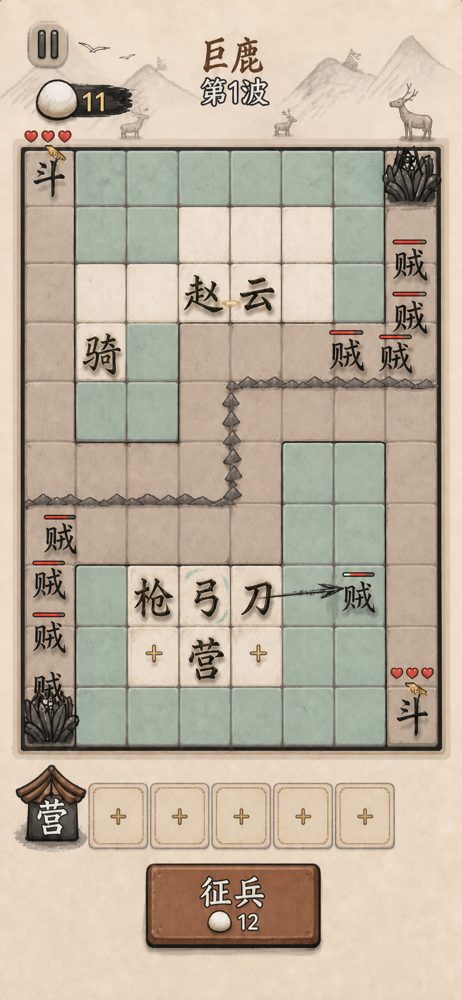

# 《赵云与阿斗》完整棋盘与汉字弈子集成稿

> 用途：验证去解剖化汉字弈子放回真实棋盘后的尺寸、辨识度、敌我区分和整体美术协调性。
>
> 状态：概念稿，尚未接入运行时；生成文字与数值只作视觉示意。

## 生成信息

- 生成日期：2026-07-20
- 生成方式：Codex 内置 `imagegen`
- 精确模型版本：工具未暴露
- 棋盘布局参考：[原始聊天截图](references/chat-board-reference.png)
- 标注区域参考：[聊天标注截图](references/chat-board-reference-annotated.png)
- 弈子造型参考：[03 篆隶化形](../unit-directions/03-seal-clerical-motion/unit-concept-sheet.png)
- 首稿修订：移除 `弓` 外围的闭合青绿色圆圈，改为沿字笔画分布、不会闭合的浅青墨边。
- 权利状态：AI 概念稿；正式商用前仍需完成人审、字形校对和平台条款核查。

## 01 篆隶字兵集成棋盘



### 视觉 thesis

一张温暖、可触摸的 2.5D 水墨小战场：汉字自身承担兵种和人物感，宣纸格子与轻投影承担立体感，不依赖四肢、五官、棋子或字牌。

### 画面验证点

- 完整保留顶部状态、8×10 主棋盘、敌军道路、五格营栏和征兵按钮的工作层级。
- `赵 / 云` 在上方相邻格组成英雄字组；`枪 / 弓 / 刀` 在下方阵地区域围绕 `营` 排列。
- 我方弈子使用圆转、略厚的篆隶化墨字；敌方 `贼` 更薄、更平，并用短红血条区分。
- 弈子直接落在棋盘格上，只有接触阴影；没有圆盘、底座、方牌或独立身体。
- `弓` 的选中态为不闭合浅青墨边；攻击态用短飞白轨迹，不改变字本体。
- 配色继续限制为宣纸米白、墨黑、低饱和青瓷绿、灰调绛红和极少状态红。

### 当前结论

- 字兵放入真实棋盘后仍能识别，且比“汉字小人”更自然。
- `03 篆隶化形` 适合作为常驻静态弈子；`05 墨灵余势` 更适合作为攻击、技能和升级时的临时特效层。
- 正式实现时应按真实 Canvas 网格重新绘制，不直接使用整张概念图作背景。
- 参考截图中的 `骑 / 斗` 等侧边单位被保留用于观察整体密度，不代表最终兵种清单。

## 最终提示词摘要

```text
Use case: ui-mockup
Asset type: polished portrait mobile game battle-screen concept
Primary request: 保留参考截图的顶部状态、完整 8×10 棋盘、敌军路径、五格营栏和征兵按钮，将界面改成克制的 2.5D 水墨材质，并把汉字弈子放回真实格子。
Allied units: 上方相邻格放“赵 / 云”，下方围绕“营”放“枪 / 弓 / 刀”；字本体使用圆转篆隶化浅浮雕，直接落在格子上。
Enemy units: 道路和侧边入口放若干“贼”，使用更薄墨字和短红血条区分。
Interaction state: 选中态只用贴合笔画且不闭合的浅青墨边；攻击态只用短飞白轨迹。
Materials: 宣纸、哑光墨、纸浆浅浮雕、彩绘木、轻接触阴影。
Constraints: 不得出现独立头脸、五官、手脚、人体、外接兵器、圆棋子、底座、字牌、高饱和配色、红色标注或桌面窗口边框。
```

## 正式落地前复验

1. 用项目真实字体和 Canvas 绘制复刻 `枪 / 弓 / 刀 / 赵 / 云 / 贼`，不要依赖生成图中的字形轮廓。
2. 在 1×、0.75×、0.5× 三档显示尺寸检查复杂字可读性。
3. 分别截图待机、选中、拖拽、攻击、升级和合成状态，确认特效没有重新形成棋子底座。
4. 在手机真机上检查手指遮挡、血条与字兵重叠、道路拥挤和低亮度可见性。
