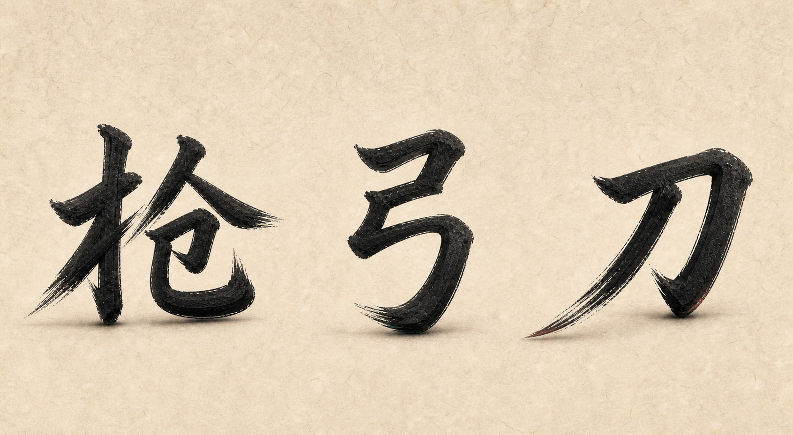
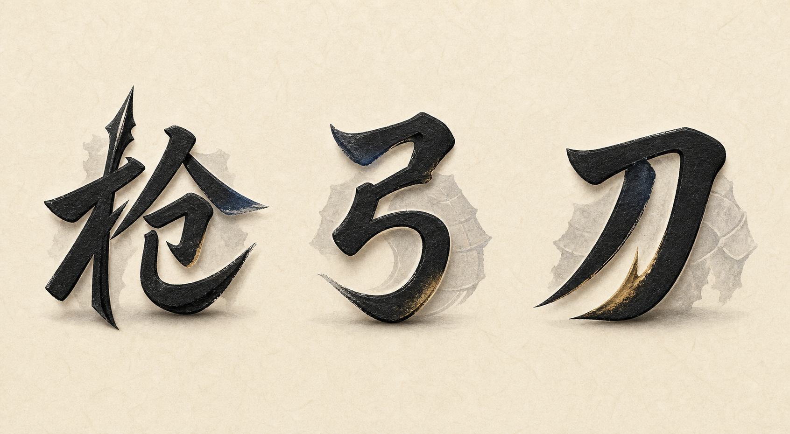
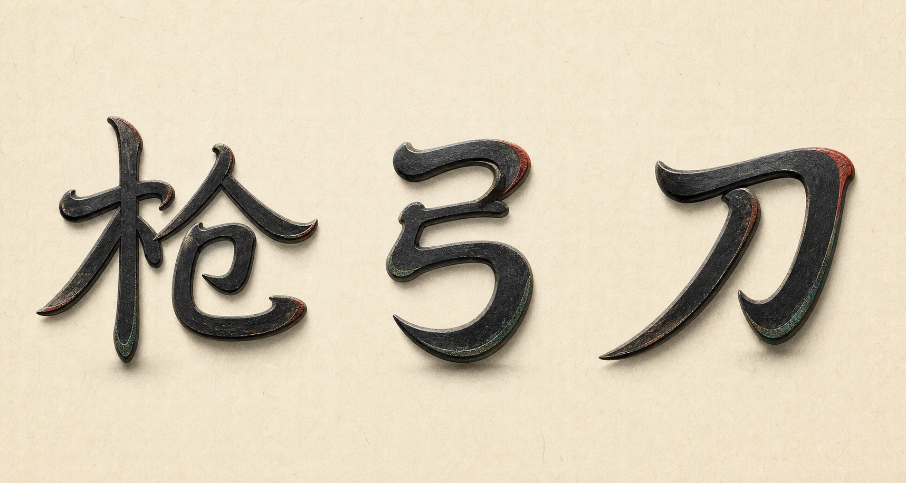
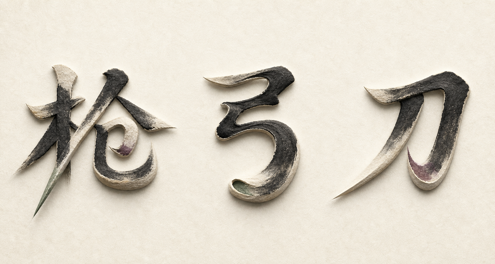
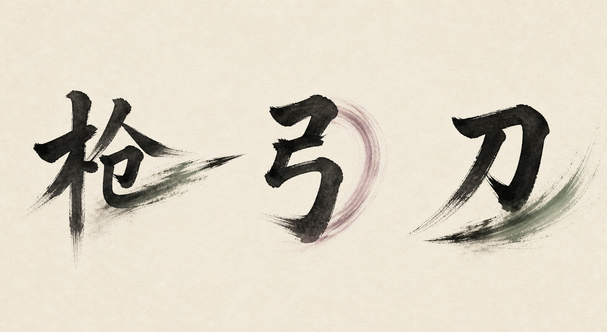

# 《赵云与阿斗》汉字弈子造型方向

> 用途：比较“汉字仍是汉字，但具有兵势与生命感”的弈子造型方法。
>
> 状态：独立概念页，尚未拆分透明素材，也未接入运行时。

完整棋盘中的实际比例与组合效果见 [完整棋盘与汉字弈子集成稿](../board-directions/README.md)。

## 生成信息

- 生成日期：2026-07-20
- 生成方式：Codex 内置 `imagegen`
- 精确模型版本：工具未暴露
- 每张内容：从左到右固定为简体 `枪 / 弓 / 刀`，不包含棋盘、HUD 或其他游戏界面。
- 共同材质：宣纸、哑光墨、克制的 2.5D 厚度与轻接触阴影。
- 权利状态：AI 概念稿；正式商用前仍需完成人审、字形校对和平台条款核查。

## 共通造型规则

1. 第一眼必须读成准确汉字，人物感只能作为第二层感受。
2. 不添加独立的头、脸、五官、手臂、手、腿、脚、衣服、帽子或小人身体。
3. 兵器只能由原有笔画、笔锋、留白或运动轨迹自然产生，不能依靠“手拿武器”。
4. 不使用圆棋子、底座、字牌、方框、印章边框或承托台。
5. 生命感来自字势、重心、收放、飞白、厚薄、负形和墨迹余势。

## 方向索引

| 编号 | 方向 | 主要方法 | 特点 | 概念图 |
| --- | --- | --- | --- | --- |
| 01 | 字势成兵 | 倾斜、收放、重心、笔锋 | 字形最纯粹、实现最稳 | [查看](01-calligraphic-stance/unit-concept-sheet.png) |
| 02 | 墨甲负形 | 笔画留白、背后淡墨重量块 | 战斗感较强、仍无人体 | [查看](02-negative-space-armor/unit-concept-sheet.png) |
| 03 | 篆隶化形 | 篆书圆转、隶书横势、现代简体骨架 | 字形与 2.5D 的平衡最好 | [查看](03-seal-clerical-motion/unit-concept-sheet.png) |
| 04 | 纸塑浮雕 | 笔画厚薄、折面、卷曲、浅浮雕 | 材质和触摸感最强 | [查看](04-paper-relief/unit-concept-sheet.png) |
| 05 | 墨灵余势 | 飞白、尾墨、蓄力弧、挥砍轨迹 | 水墨动态最强、立体感较弱 | [查看](05-ink-afterimage/unit-concept-sheet.png) |

## 01 字势成兵



- 人物感来源：字的站立重心和向前/向后的笔势。
- 优点：最不突兀，小尺寸仍容易识别，适合直接用 Canvas 字形与少量形变实现。
- 风险：若动态反馈不足，静止时可能更像普通文字。
- 生成尺寸：1692 × 929 PNG。

## 02 墨甲负形



- 人物感来源：笔画间负形和字后淡墨重量块，隐约产生披甲感，但不形成身体。
- 优点：战斗身份更强，适合区分敌我、职业或等级。
- 风险：背后墨块过重时会影响棋盘可读性，落地时应控制透明度。
- 生成尺寸：1692 × 930 PNG。

## 03 篆隶化形



- 人物感来源：篆书圆转与隶书横势重新组织字的节奏，但保留现代简体骨架。
- 优点：没有外加结构，字形、兵势与圆润 2.5D 最自然地融合；当前优先推荐继续深化。
- 风险：不能为了古意改成玩家难以辨认的古文字。
- 生成尺寸：1717 × 916 PNG。

## 04 纸塑浮雕



- 人物感来源：原有笔画的厚薄、挤压、卷曲和前后层次。
- 优点：最接近此前选定的圆润 2.5D 触感，同时消除了四肢和五官。
- 风险：浅色纸塑边缘过多时，复杂字在小尺寸下可能损失笔画辨识度。
- 生成尺寸：1717 × 916 PNG。

## 05 墨灵余势



- 人物感来源：字后飞白、蓄力弧、冲刺尾墨和挥砍轨迹。
- 优点：水墨气最强，攻击、升级和技能状态容易做出层次。
- 风险：更适合作为动态状态或特效层，不宜让常驻尾墨遮挡相邻格子。
- 生成尺寸：1693 × 929 PNG。

## 最终生成提示词结构

```text
Use case: stylized-concept
Asset type: game unit character design exploration sheet
Primary request: 在一张干净横向概念页中，从左到右恰好展示“枪”“弓”“刀”，各出现一次、等大、独立且一眼可读。
Scene/backdrop: 仅暖米白宣纸；无棋盘、UI、场景或装饰边框。
Style/medium: 克制的中国水墨与圆润 2.5D 纸塑；哑光墨色、轻厚度、柔和接触阴影。
Core rule: 完整准确的汉字是唯一主体；生命感只能来自原有笔画的字势、重心、厚薄、负形或墨迹余势。
Constraints: 不得出现独立头脸、五官、手臂、手、腿脚、身体、衣帽、人形剪影、外接兵器、棋子、底座、字牌、标签、额外汉字、Logo 或水印。
```

五个方向只替换 `Core rule`：

- 01：倾斜、收放、重心和笔锋形成站姿与攻防势。
- 02：笔画负形与字后抽象淡墨重量块形成甲胄感。
- 03：现代简体骨架结合篆书圆转和隶书横势。
- 04：笔画厚薄、挤压、卷曲和折面形成纸塑浅浮雕。
- 05：飞白、尾墨和依附原笔画的运动弧形成蓄力与攻击感。

## 进入正式素材前

1. 先选一个主方向，再单独制作 `枪 / 弓 / 刀` 的透明静态素材。
2. 每个字补齐待机、选中、攻击、升级四种状态；尽量用形变和特效层，不重新添加人体结构。
3. 放回真实棋盘，用 1×、0.75× 和 0.5× 尺寸验证可读性、遮挡和敌我识别。
4. 最终字形由人工逐笔校对，生成图只作为造型参考。
