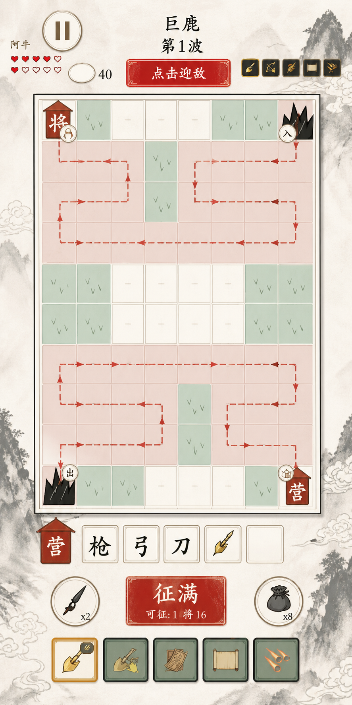
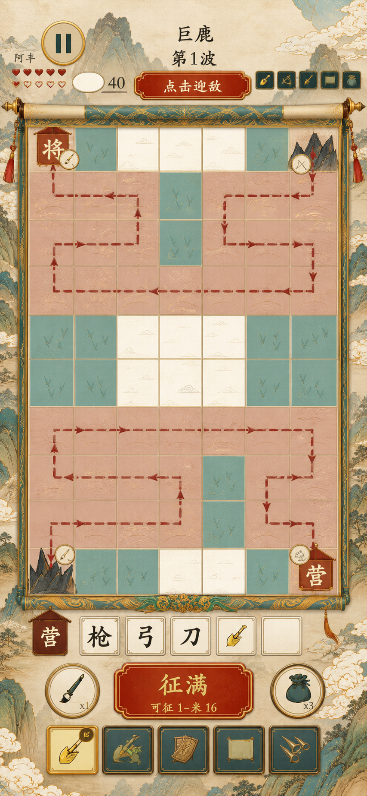
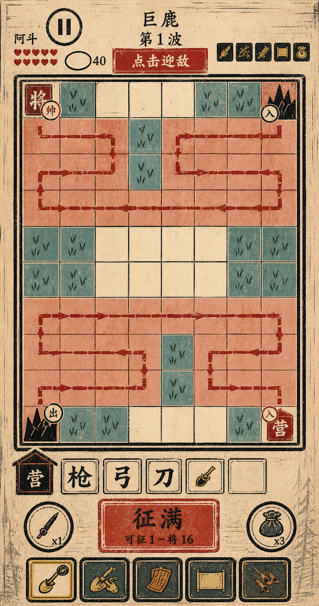
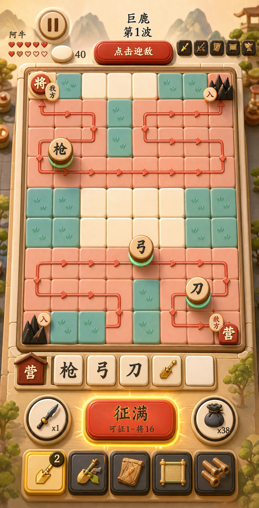
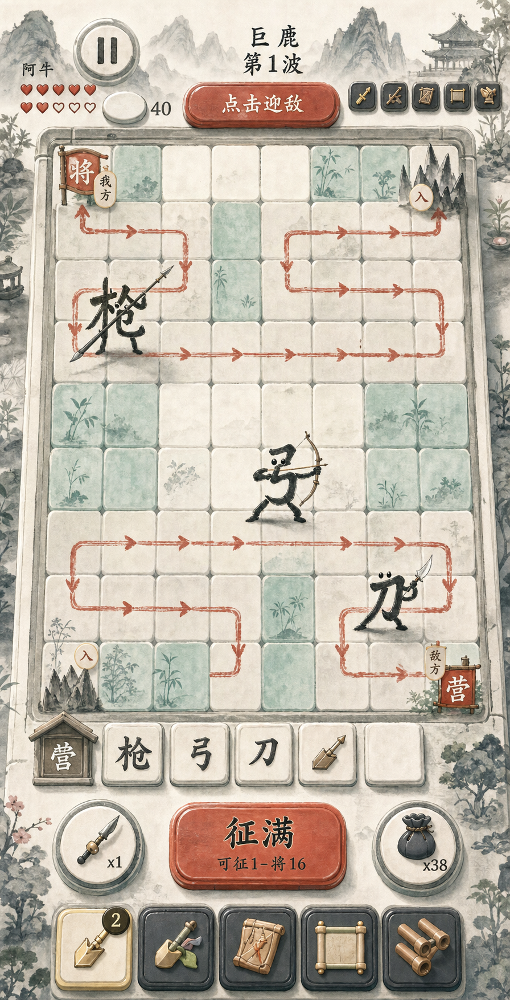
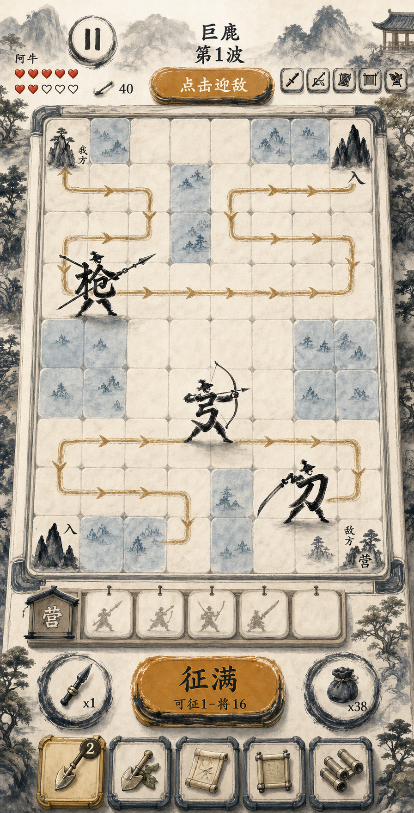
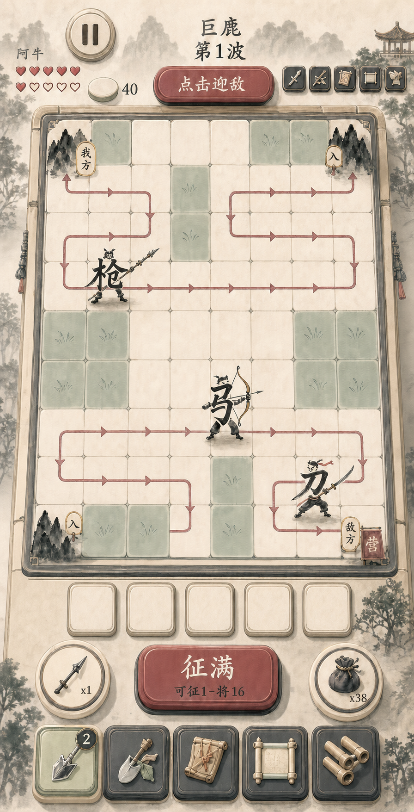

# 《赵云与阿斗》视觉方向概念稿

> 用途：比较战斗页的美术方向，作为后续主题、Canvas 表现令牌和正式素材制作的参考。
>
> 状态：概念稿，尚未接入运行时；图片中的中文和数值不作为最终 UI 文案依据。

弈子已另建专项方向，不与整页 UI 概念稿混放：见 [汉字弈子造型方向](../unit-directions/README.md)。

## 生成信息

- 生成日期：2026-07-20
- 生成方式：Codex 内置 `imagegen`
- 精确模型版本：工具未暴露
- 布局参考：`test-artifacts/screenshots/2026-07-20/g1f-02-route-and-zones.png`
- 共同约束：保留顶部状态、8×10 棋盘、路线、五格营栏、征兵按钮、左右道具和底部工具栏的语义，只比较美术风格。
- 权利状态：AI 概念稿；如用于商用发布，仍需按项目权利台账完成人审与平台条款核查。

## 方案索引

| 编号 | 方向 | 关键词 | 概念图 |
| --- | --- | --- | --- |
| 01 | 朱砂青绿·明快水墨 | 明亮宣纸、浓墨骨架、朱砂操作、青绿阵地、鎏金奖励 | [查看](01-bright-ink/battle-ui-concept.png) |
| 02 | 工笔重彩·武将演义 | 工笔线描、矿物色、卷轴边框、青绿山水、商业手游质感 | [查看](02-gongbi-color/battle-ui-concept.png) |
| 03 | 木版套色·汉字兵阵 | 活字字牌、套色版画、粗黑刻线、朱红路线、四套色系统 | [查看](03-woodblock-type/battle-ui-concept.png) |
| 04 | 圆润国风·2.5D 卡通战棋 | 软倒角、抬升字牌、立体导轨、圆润按钮、暖光玩具沙盘 | [查看](04-rounded-cartoon-2_5d/battle-ui-concept.png) |
| 05 | 雨过青瓷·2.5D 水墨字兵 | 青瓷绿主色、柔和朱砂、明亮宣纸、汉字直接成人形 | [查看](05-ink-2_5d-celadon-cinnabar/battle-ui-concept.png) |
| 06 | 夜航黛蓝·2.5D 水墨字兵 | 黛蓝主色、旧琥珀次色、沉稳英雄气、汉字直接成人形 | [查看](06-ink-2_5d-indigo-amber/battle-ui-concept.png) |
| 07 | 松烟绛梅·2.5D 水墨字兵 | 松烟绿主色、灰调绛梅、温润古雅、汉字直接成人形 | [查看](07-ink-2_5d-pine-plum/battle-ui-concept.png) |

## 01 朱砂青绿·明快水墨



- 视觉 thesis：让水墨从“旧纸灰褐”转为明亮、克制、可读的现代水墨战棋。
- 配色角色：纸色负责背景，浓墨负责结构，朱砂负责操作和危险，青绿负责可操作区，鎏金负责英雄与奖励。
- 实施特点：现有 Canvas 和素材复用率高，立体感较弱。

## 02 工笔重彩·武将演义



- 视觉 thesis：以工笔线描、矿物色和青绿山水形成华丽的武将演义氛围。
- 表现重点：卷轴、旗穗、金线和英雄/奖励的高价值感。
- 实施特点：冲击力强，但素材、包体和小屏信息密度成本最高。

## 03 木版套色·汉字兵阵



- 视觉 thesis：把“汉字就是士兵”做成可识别的活字与套色木版体系。
- 表现重点：雕版线条、朱红军阵线、靛青格子、印章与活字压印反馈。
- 实施特点：品牌辨识度高、适合 Canvas，但整体更硬朗、复古。

## 04 圆润国风·2.5D 卡通战棋



- 视觉 thesis：像一套被暖光照亮的国风桌面玩具，圆润、立体、亲和但不幼稚。
- 材质：柔和黏土与彩绘木块；格子有软倒角、环境遮蔽和轻投影。
- 棋子：汉字做成抬升的圆形或方形实体字牌，保留清晰书法字形。
- 路线：从平面虚线升级为略微抬升的珊瑚色导轨与箭头节点。
- 按钮：朱砂漆木的圆角实体按钮，具备高光、压下深度和金色操作反馈。
- 实施特点：最符合“立体、圆润、偏卡通”的最新反馈；正式落地需要建立统一的倒角、阴影、材质和动效令牌，不能只给按钮添加阴影。

## 05—07 共通方向：2.5D 水墨字兵

- 视觉 thesis：保留第 04 套圆润、可触摸的 2.5D 体积，把玩具塑料感换成宣纸、淡墨、彩绘木、丝绢和哑光漆。
- 配色纪律：宣纸米白与墨黑等中性色约占 70%，一种主色约占 20%，一种次色约占 8%，其余状态色合计不超过 2%。
- 弈子规则：不是“人物身上贴一个字”，而是让汉字笔画本身构成头肩、躯干和四肢；`枪` 持长枪、`弓` 拉弓、`刀` 挥刀，直接站在格子上。
- 明确排除：圆棋子、方形字牌、圆盘底座、塑料高光、荧光色、彩虹配色和堆叠金色装饰。
- 实施提示：汉字仍须一眼可读；表情只用少量眼神或眉形，武器和动作负责区分职业，接触阴影负责落地感。

## 05 雨过青瓷



- 主色：低饱和青瓷绿 `#6F9E8C`，用于可部署区、阵地结构和竹叶纹理。
- 次色：柔和朱砂 `#C55A45`，用于行军路线、主操作按钮和危险提示。
- 气质：三套中最明快、亲和，适合轻量休闲与微信小游戏首屏。
- 生成尺寸：896 × 1754 PNG。

## 06 夜航黛蓝



- 主色：低饱和黛蓝 `#405F73`，用于可部署区、框架和远山层次。
- 次色：旧琥珀金 `#C4913F`，用于路线、主操作按钮和关键反馈。
- 气质：三套中最沉稳、最有英雄史诗感，但要避免整体明度继续降低。
- 生成尺寸：896 × 1754 PNG。

## 07 松烟绛梅



- 主色：低饱和松烟绿 `#557066`，用于可部署区、框架和山林。
- 次色：灰调绛梅 `#8E4F5A`，用于路线、主操作按钮和敌情反馈。
- 气质：三套中最温润古雅，格子、按钮和字兵的 2.5D 体积关系也最完整。
- 生成尺寸：896 × 1755 PNG。

## 05—07 生成提示词摘要

```text
Use case: ui-mockup
Asset type: 竖版手机战斗 UI 概念图
Primary request: 保持方案 04 的圆润 2.5D、轻俯视棋盘与完整战斗页层级，改成明亮水墨材质，并生成三套克制的主色 + 次色方案。
Subject: 让“枪 / 弓 / 刀”的书法笔画直接构成人形躯干和四肢，分别持长枪、拉弓、挥刀；汉字清晰可读并直接站在格子上。
Materials: 宣纸、淡墨晕染、彩绘木、哑光漆、丝绢；保留柔和倒角、环境遮蔽和接触阴影。
Color palette: 中性色约 70%，单一主色约 20%，单一次色约 8%，其余状态色不超过 2%。
Constraints: 保留顶部 HUD、主战场、五格营栏、征兵按钮、左右道具和底部工具栏；不得出现圆棋子、字牌、台座、荧光色、彩虹配色、塑料高光或额外复杂装饰。
```

## 后续使用原则

1. 先选定一个主方向，再把颜色、圆角、倒角、阴影、材质和动效落到 `theme` / `presentation` 配置。
2. 不直接把整张概念图作为游戏背景；棋盘、字兵、按钮和图标应拆成可交互的 Canvas 绘制或独立素材。
3. 正式实现继续使用真实 UI 文案和游戏状态，不依赖概念图中的生成文字。
4. 新增变体时使用新的编号目录，不覆盖已有概念稿。
